# GeneXpert Machine Interfacing

A desktop app that can be used to interface between GeneXpert machines and ETL. The app is written in Electron and uses SQLite to as a data storage.

## Run Locally

Clone the project

```bash
  git clone https://github.com/udsm-dhis2-lab/GeneXpert
```

Go to the project directory

```bash
  cd GeneXpert
```

Install dependencies

```bash
  npm install --legacy-peer-deps
```

Start the server

```bash
  npm start
```

## Building

- The app can be built as an executable depending on the environment you choose since the underlying electron technology produces a crossplatform app.

- From your app directory in terminal, run

```bash
npm run package
```

- By default, the above command produces an executable similar to the os used to run.

- The executable will be available in

```bash
releases
```

## Tech Stack

**Client:** Angular, Redux, Bootstrap, and Angular Material

**Renderer:** Electron

## Features Supported

### Authentication

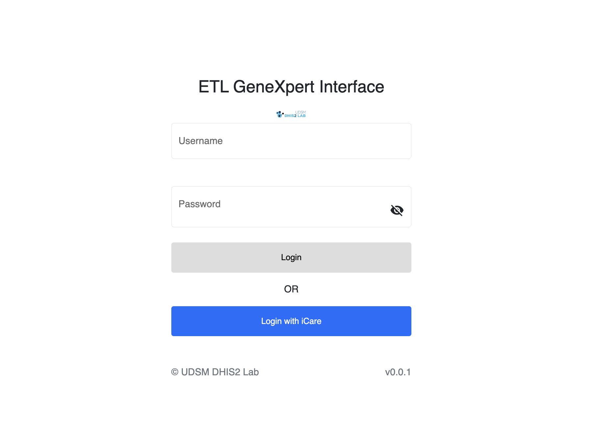

- In app (App users)

- External login
  - External login is Supported since the app was built to link with any LIS systema and not just ETL so a user can either login with in app user credentials or external system credentials.

### Settings

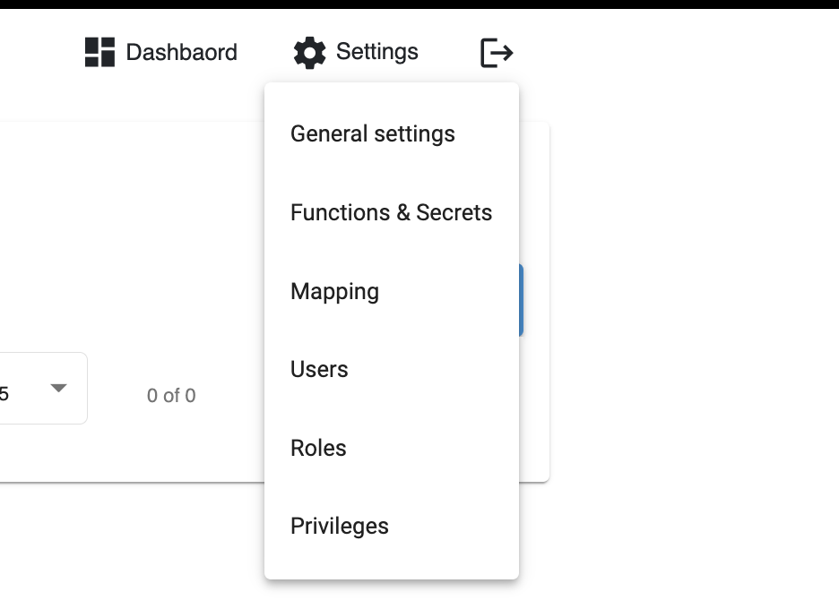

      1. General Settings(Machine configurations and General System Settings)
      2. Functions and Secrets(To the core, the app uses functions for communication to any LIS)
      3. Mapping(If an external LIS uses mapped items for data, then you can add the mappings to be used in data sync)
      4. Users, Roles and Privileges(Creating in app users and their credentials)

#### General Settings

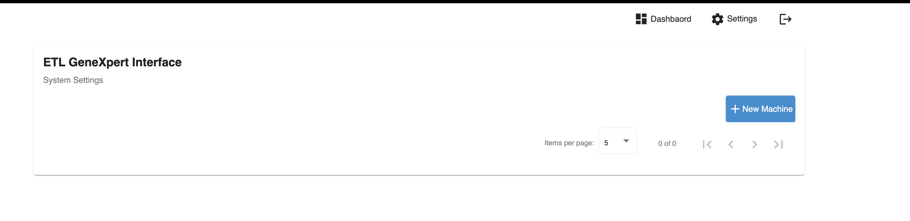

- From this page, we can add new machines and their respectives settings ready for connnection.

- Adding new Machine with details


#### Functions and Secrets

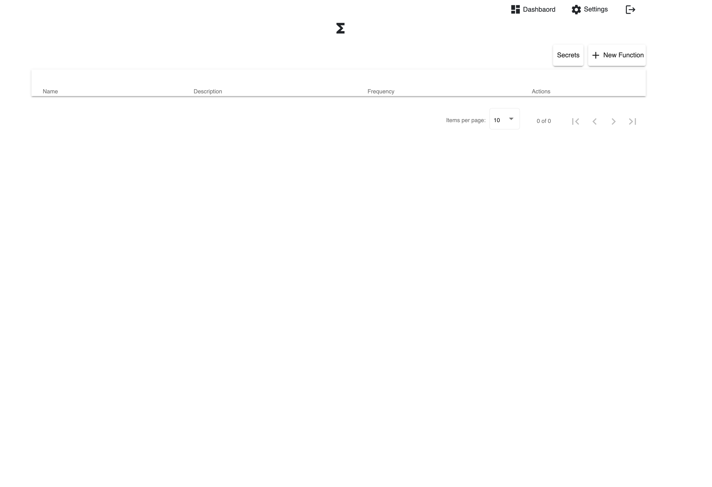

- You can add new JavaScript functions that are used to sync between the app and LIS. Also these externally written functions are the ones used for external login.

- Every function contains optional secrets that can be sensitive information inserted in the functions at the time of execution.

Adding a new function
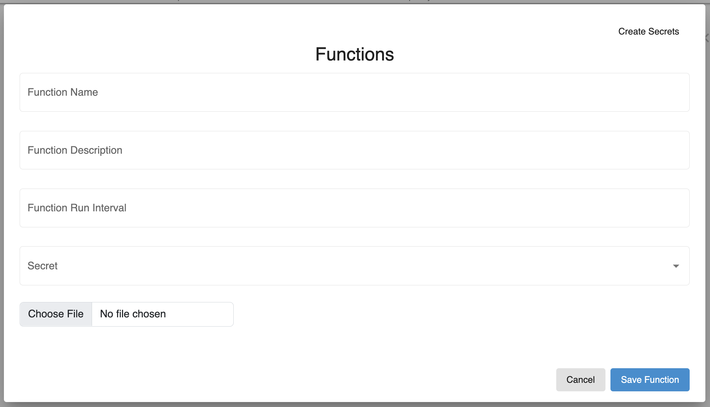

Adding new Secret
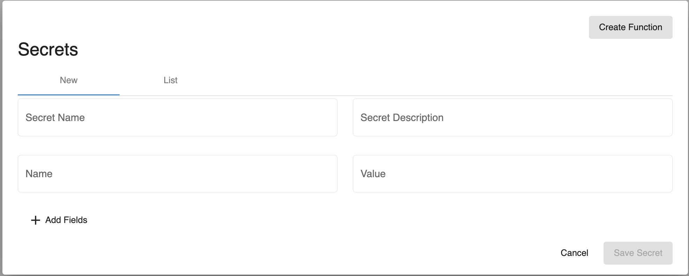

#### Mapping

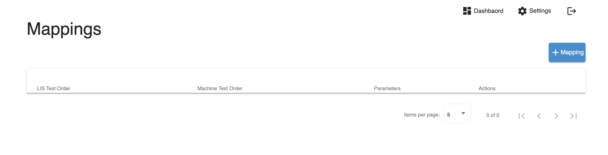

- This section of settings helps with adding mappings if the LIS with which the app sending data requires that.

### Dashboard

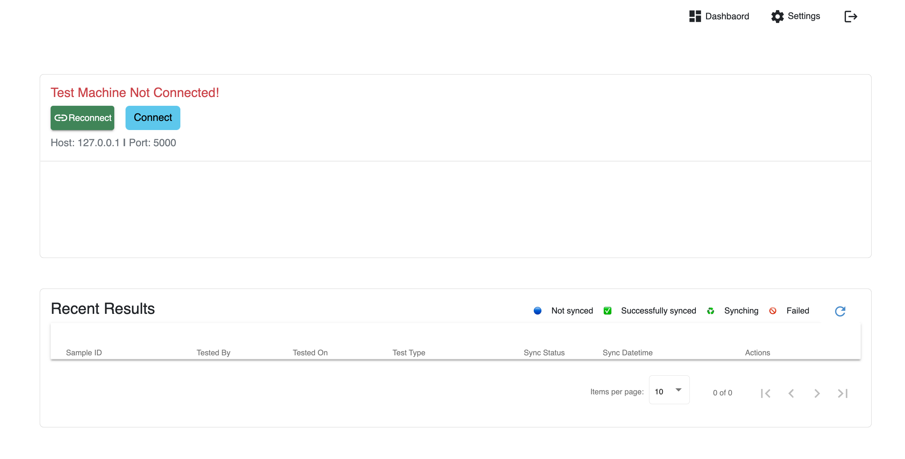

- The dashboard shows the following

  - Live application Logs(Data and sync logs)
    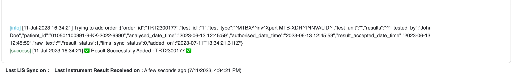
  - Sync status summaries
    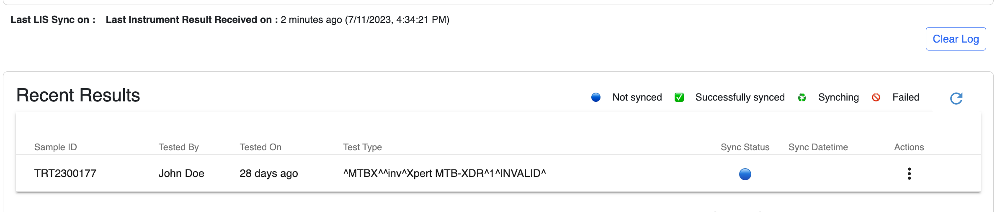

  - Machine connection status(Shows the machine connection status, the last connected machine IP and Port and you can reconnect or choose a new machine to connect to )
    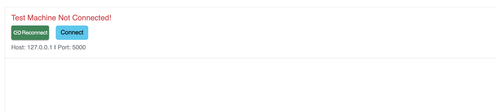

  - You can select a new machine to connect to from the list of available with `connect` button from the previous image
    

  - A connected machine will look as in the image below
    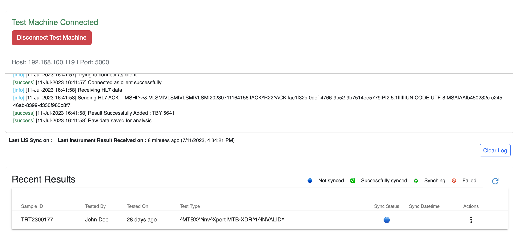

### Sync Data

- We can sync data between app and LIS with the following methods

  - Manual sync one record at a time
    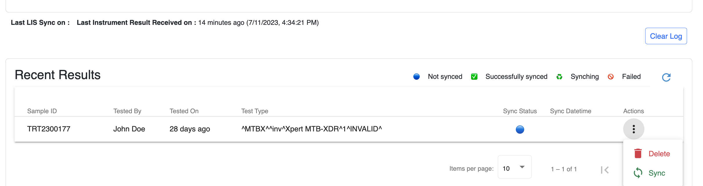

  - Run a function that is responsible for data sync
    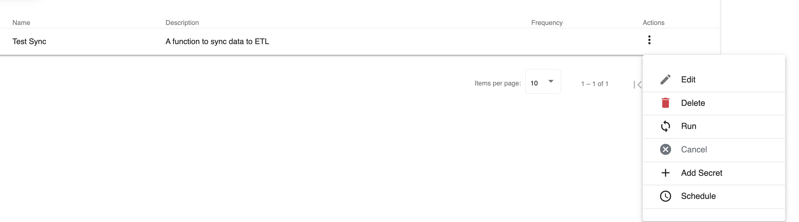
  - You can also schedule your sync to run at your desired time
    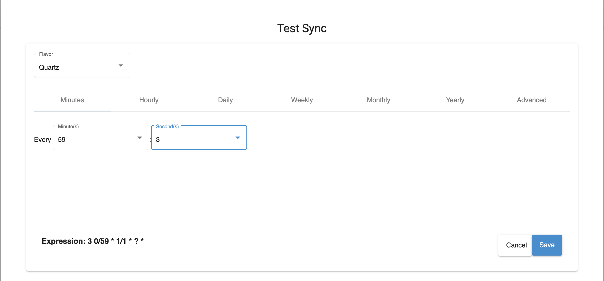

  - In every machine, you can also set data to sync directly to LIS as soon as it is received in the general machine settings

## Contributing

The App currently closed source but this information will be updated as soon as it is open sourced

## Used By

This project is used by the following companies:

- [NTLP](https://ntlp.go.tz/)
- [NPHL](https://nphl.go.tz)

## Roadmap

- Add support for FTP communication machines

- Add support for Serial communication machines

- Add support for multiple paralle connection
